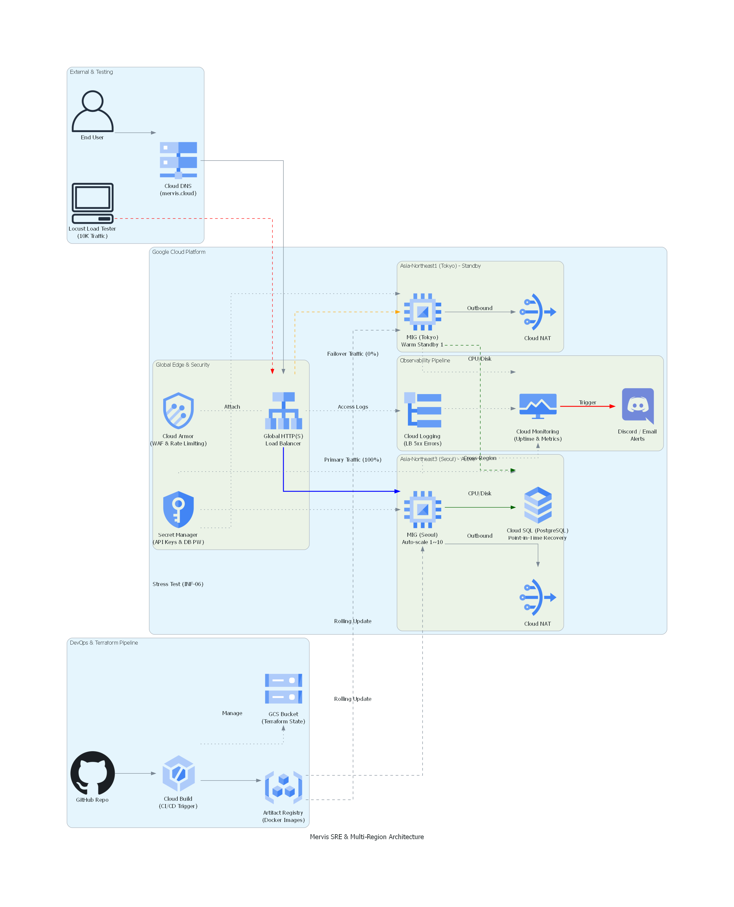

# MERVIS Infrastructure: Cloud-Native High Availability & SRE Portfolio

## Overview
**Mervis Infrastructure**는 대규모 트래픽 처리, 멀티 리전 재해 복구(DR), 무중단 배포 및 보안을 위해 Google Cloud Platform(GCP) 상에 구축된 클라우드 네이티브 인프라 코드(IaC) 저장소입니다.

단순한 서버 프로비저닝을 넘어, SRE(Site Reliability Engineering) 관점에서 시스템의 가용성(Availability), 복원력(Resiliency), 관측성(Observability)을 확보하는 데 집중했습니다. 모든 리소스는 Terraform을 통해 모듈화되어 관리됩니다.

---

## Architecture Diagram

(설명: 서울 메인 리전과 도쿄 DR 리전으로 구성된 글로벌 분산 아키텍처 및 트래픽 라우팅 흐름도)

---

## Core SRE & FinOps Features

### 1. Multi-Region Disaster Recovery (Active-Passive)
* 글로벌 HTTP(S) 로드밸런서를 기반으로 멀티 리전 분산 환경을 구축했습니다.
* **Warm Standby:** 평상시에는 서울 리전(asia-northeast3)에서 100%의 트래픽을 처리하며, 도쿄 리전(asia-northeast1)에는 최소 인스턴스(1대)만 대기시켜 비용을 최적화합니다.
* **Auto-Failover:** 서울 리전 데이터센터 전체 장애 발생 시, 로드밸런서의 상태 검사(Health Check)가 이를 감지하고 다운타임(500 에러) 없이 도쿄 리전으로 트래픽을 자동 우회시킵니다.

### 2. Auto-Scaling & Self-Healing
* **Scale-out/in:** CPU 사용률 50%를 임계치로 설정한 Managed Instance Group(MIG) 오토스케일러를 통해 트래픽 스파이크 시 서버를 동적으로 확장합니다.
* **Self-Healing:** 애플리케이션 프리징(Hang) 발생 시 로드밸런서가 비정상(Unhealthy) 상태를 감지하고, 해당 좀비 인스턴스를 강제 종료한 뒤 즉각 재생성하여 가용성을 유지합니다.

### 3. Point-in-Time Recovery (PITR)
* Cloud SQL(PostgreSQL)에 특정 시점 복구(PITR) 기능을 활성화했습니다.
* 휴먼 에러(Drop Table 등)나 데이터 오염 발생 시, 트랜잭션 로그(WAL)를 기반으로 장애 발생 직전의 분 단위 시점으로 데이터를 클론(Clone) 및 복원할 수 있는 방어 체계를 갖추었습니다.

### 4. Cloud Armor WAF & Rate Limiting
* 백엔드 서비스 전단에 Cloud Armor(웹 방화벽)를 배치하여 인프라를 보호합니다.
* 단일 IP에서 1분당 100회 초과 요청 시 즉각 403 Forbidden으로 차단하는 Rate Limiting 규칙을 적용하여 악의적인 봇과 DDoS 공격을 무력화합니다.

### 5. Observability Pipeline
* **Uptime Check:** 외부망(글로벌 프로브)에서 도메인(mervis.cloud)의 정상 응답 여부를 주기적으로 감시합니다.
* **Log-based Alerts:** 시스템 지표(CPU/Disk 50% 초과) 및 로그 지표(로드밸런서 5xx 에러율)를 모니터링하여, 이상 징후 발생 시 SRE 팀의 Discord Webhook 및 이메일로 실시간 경보(Alert)를 발송합니다.

---

## Repository Structure

``` bash
Mervis_Infra/
├── main.tf                 # 인프라 프로비저닝 메인 엔트리
├── variables.tf            # 전역 변수 관리 (Project ID, Region 등)
├── outputs.tf              # 루트 출력값 (Load Balancer IP 등)
├── provider.tf             # GCP 프로바이더 및 Terraform 버전 설정
├── monitoring.tf           # Cloud Monitoring 알람 정책 (Discord, Email)
├── locust.tf               # 부하 테스트용 Locust VM 프로비저닝 설정
├── modules/                # 리소스별 Terraform 모듈
│   ├── network/            # VPC, Subnet, Cloud NAT, 방화벽(Firewall)
│   ├── compute/            # Instance Template, MIG, Auto-scaler (Seoul/Tokyo)
│   ├── lb/                 # Global HTTP(S) Load Balancer, SSL Certificate
│   ├── database/           # Cloud SQL (PITR), Secret Manager 연동
│   ├── security/           # Cloud Armor (WAF, Rate Limiting)
│   └── storage/            # Cloud Storage (Tfstate 관리, 백업용)
└── README.md               # 프로젝트 아키텍처 및 인프라 명세서
```

---

## Tech Stack

``` text
* Infrastructure as Code (IaC): Terraform
* Cloud Provider: Google Cloud Platform (GCP)
* Computing: Google Compute Engine (MIG)
* Networking: Cloud DNS, Cloud CDN, Global Load Balancer, Cloud NAT
* Database & Storage: Cloud SQL (PostgreSQL), Cloud Storage
* Security: Cloud Armor, Secret Manager, IAM
* Observability: Cloud Monitoring, Cloud Logging
* Testing Tools: Locust (Load Testing)
```

---

## Load Testing & Validation Log
실제 인프라 검증을 위해 수행한 전체 테스트 및 트러블슈팅 내역입니다.

* [INF-01] 가용성 확보 (좀비 테스트): VM 강제 삭제 시 Managed Instance Group(MIG)의 즉각적인 재생성(Recreating) 동작을 확인하여 시스템의 기본 가용성 검증.
* [INF-02] 자가 치유 (Self-Healing): 애플리케이션 프리징(Docker Pause) 유발 시, 로드밸런서 Health Check가 이를 감지하고 비정상 인스턴스를 강제 교체하는 자가 치유 메커니즘 확인.
* [INF-03] 배포 실패 및 자동 롤백: 문법 오류가 포함된 코드 푸시 시, Health Check(HTTP 502) 실패를 통해 신규 인스턴스 배포를 차단하고 기존 정상 버전으로 무중단 롤백 검증.
* [INF-04] 보안 및 접근 통제 (IAM): Secret Manager 접근 권한을 제거하여 최소 권한 원칙(PoLP)을 검증하고, 탈취 상황 가정 시 애플리케이션의 기동 차단(Fail Fast) 확인.
* [INF-05] 자원 임계치 모니터링: 서버 CPU 사용률 100% 도달 및 임계치(70%) 초과 상황을 유발하여 이메일 및 Discord 경보 시스템의 정상 작동 확인.
* [INF-06] 확장성 (Auto-scaling) 부하 테스트: Locust를 이용한 1만 명 동시 접속 스파이크 테스트 수행. 대기열(Queue) 시스템 적용 및 인스턴스 Scale-out을 통해 서버 다운 없이 성공적으로 트래픽 방어.
* [INF-07] Cloud Armor DDoS 방어: 단일 IP에서 악의적인 과부하(분당 120건) 주입 시, 100건 초과 시점부터 403 Forbidden으로 즉각 차단되는 방화벽(WAF) 동작 검증.
* [INF-08] CI/CD 무중단 롤링 배포: Cloud Build를 통한 자동 배포 과정 중 Locust 트래픽을 주입하여, 서비스 유실(Failures 0%) 없이 새로운 인스턴스 템플릿으로 교체되는 무중단 배포 확인.
* [INF-09] DB 특정 시점 복구 (PITR): 의도적인 DB 테이블 삭제(Drop) 장애 유발 후, 트랜잭션 로그(WAL)를 활용해 데이터 유실 없이 삭제 직전 시점으로 완전 복원 성공.
* [INF-10] 멀티 리전 DR 페일오버: 서울 리전 전체 다운(인스턴스 0대) 시뮬레이션 시, 접속 유실(500 에러) 없이 대기 중인 도쿄 리전(Warm Standby)으로 트래픽이 자동 전환되고 정상 원복되는 과정 검증.
* [INF-11] 통합 모니터링 및 알림(Observability): 외부 Uptime Check 및 로드밸런서 5xx 에러 감지 로직을 추가하여 장애 발생 시 즉각적으로 알림을 수신하는 장애 대응 파이프라인 구축 완료.